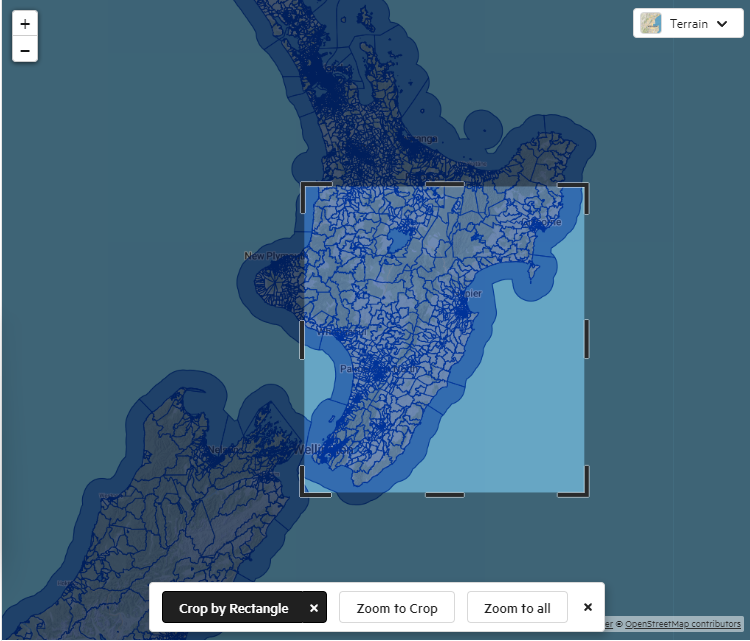

# A study of extreme flooding and primary care access in Te Matau-a-Māui, Aotearoa (Hawke's Bay, New Zealand)

### Authors

- Grace Sokolow\*, gracetsokolow@gmail.com, @gsokolow, Middlebury College

\* Corresponding author and creator

### Abstract

A month of heavy rainfall on the North Island in January 2023 saturated the soils and rivers of Te Matau-a-Māui Hawke's Bay. [1](https://disasterphilanthropy.org/disasters/2023-new-zealand-floods/) 
When Cyclone Gabrielle hit in February, the region experienced "widespread damage and flooding. [...] Over 70,000 residents were left without lifelines including health services, power, road connectivity (in every direction), waste water, drinking water, internet, and cellphone networks. [2](https://www.napier.govt.nz/our-council/cyclone-gabrielle/#:~:text=February%2014%202023%20is%20a,of%20extreme%20isolation%20and%20vulnerability.)
Cyclone Gabrielle was not simply a destructive anomaly. Climate change is increasing storm frequency and intensity worldwide. [3](https://www.oecd.org/climate-action/ipac/the-climate-action-monitor-2023-60e338a2/chapter-d1e1621) 
In order to prepare ourselves for the climate-altered future that is coming, and indeed, perhaps already here, it is essential that we understand the potential impacts of severe precipitation events and to whom they pose the greatest risks. In this study, I will investigate the health care access impacts of Cyclone Gabrielle by calculating the travel time from small scale statistical geometries in Te Matau-a-Maui, Hawkes Bay, to the nearest primary care provider, before and after cyclone-induced road closures. Results will be contextualized using population demographics, to better understand how the burden of disaster damage may be unevenly distributed along socioeconomic lines.

1. “2023 New Zealand Floods and Cyclone Gabrielle.” Center for Disaster Philanthropy. March 21, 2023. https://disasterphilanthropy.org/disasters/2023-new-zealand-floods/
2. “Cyclone Gabrielle” Napier City Council. 2023. https://www.napier.govt.nz/our-council/cyclone-gabrielle/#:~:text=February%2014%202023%20is%20a,of%20extreme%20isolation%20and%20vulnerability.
3. “The Climate Action Monitor 2023”. OECD. November 17, 2023. https://www.oecd.org/climate-action/ipac/the-climate-action-monitor-2023-60e338a2/chapter-d1e1621

### Study Metadata

- `Key words`: extreme weather, health care access, Te Matau-a-Maui, Aotearoa, Hawke's Bay, New Zealand, network-analysis, population demographics
- `Subject`: Social and Behavioral Sciences
- `Date created`: January 2024
- `Date modified`: date of most recent revision
- `Spatial Coverage`: Hastings District in Te Matau-a-Maui Hawke's Bay Aotearoa New Zealand. Wairoa and Taraua Districts are prime candidates for expanded analysis.
- `Spatial Resolution`: Statistical Area 1. Statistical Area 2 and meshblocks may be used in a study expansion.
- `Spatial Reference System`: NZTM2000
- `Temporal Coverage`: 2018-2023. Census data (including geometries) from 2018. Road closure data from 2023. When 2023 Census data becomes available in May 2024, it can be substituted in. 
- `Temporal Resolution`: Netowrk analysis to be repeated 3 months following the initial storm in february 2023. 
- `Funding Name`: N/A
- `Funding Title`: N/A
- `Award info URI`: N/A
- `Award number`: N/A

## Study design

This is an original, observational study. It investigates two primary research questions:
1. How did road access to primary care facilities change as a result of Cyclone Gabrielle?
2. What characterizes the communities affected?

Question 1 will be investigated using network analysis. 
Question 2 will be investigated through demographic analysis and statistical testing of correlations between population and impact groups. 

## Materials and procedure

### Computational environment

Python 3.9

Additional packages required are specified in proceedure > code > 01-Jupyter Notebook.ipynb.

### Data and variables

Each of the next subsections describes one data source.

## NZ figure data 
Data from this source was used to create figures included in this study.
https://data.linz.govt.nz/layer/51153-nz-coastlines-and-islands-polygons-topo-150k/

#### Individual_part1_totalNZ-wide_format_updated_16-7-20.csv

**Standard Metadata**

- `Abstract`: demographic data from the 2018 census
- `Spatial Coverage`: Hawke's Bay Region [map](https://d1pepq1a2249p5.cloudfront.net/media/documents/North-Island-PNG.png)
- `Spatial Resolution`: statistical area 1
- `Spatial Reference System`: no geometry
- `Temporal Coverage`: 2018
- `Temporal Resolution`: Snapshot (1 day). 
  `Lineage`: Downloaded from [StatsNZ](https://www.stats.govt.nz/information-releases/statistical-area-1-dataset-for-2018-census-updated-march-2020#:~:text=The%20statistical%20area%201%20dataset%20for%202018%20Census,geographies%20%28including%20meshblocks%29%20is%20available%20by%20emailing%20info%40stats.govt.nz.%20PUBLISHED%20IN%202020) on February 12, 2024 as an xlsx file. Download Data > Regional Files (Microsoft Excel Open XML) > Hawke's Bay Region (Updated november 2021) > 2018-SA1-dataset-individual-part-1-Hawke'sBayregion_updated_28-7-20.xlsx. Downloaded again as a CSV file on February 17 from the same site. Download data > Total New Zealand files > Statistical area 1 dataset for 2018 Census, total New Zealand (updated 16 July 2020) – CSV (zipped file, 32MB).
From the zipped folder, one file was copied into data > raw > public > Individual_part1_totalNZ-wide_format_updated_16-7-20.csv.

On March 31, another file from the same zipped folder was copied into raw > public > Individual_part2_totalNZ-wide_format_updated_16-7-20.csv.

On February 14, 2024, the author changed the column names for NR, PO, PP because pyhton was unable to read the accent mark on Maori.
The results are saved under data > derived > public > Individual_part1_totalNZ-wide_format_updated_16-7-20_adjusted_labels.csv.
On February 19, 2024, the author wrote definitions for each variable of interest to this study, based on the best available information including the [Aria classification](https://aria.stats.govt.nz/aria/?_ga=2.154898296.1121281586.1708393924-651550336.1707765003#Home:) management system. The author was unable to find existing variable definitions from StatsNZ.
On February 20, 2024, the author generated a comprehensive metadata file with the following information for each variable of interest to this study:
    - Variable Name
    - Data Type
    - Minimum Value
    - Maximum Value
    - Frequency of Missing Data (includes data marked as 'C" for confidential)
    - Definition (derived by the author)
This metadata file can be found under data > metadata > 2018_Census_Statistical_Area1_Metadata_Derived.csv
- `Distribution`: Distributed by [StatsNZ](https://www.stats.govt.nz/information-releases/statistical-area-1-dataset-for-2018-census-updated-march-2020#:~:text=The%20statistical%20area%201%20dataset%20for%202018%20Census,geographies%20%28including%20meshblocks%29%20is%20available%20by%20emailing%20info%40stats.govt.nz.%20PUBLISHED%20IN%202020)
- `Constraints`: Licensed for re-use under a Creative Commons 4.0 International License
- `Data Quality`: Usually resident population count, age, and sex data is of very high quality; ethnicity and Maori descent data is of high quality according to StatsNZ (see footnotes in database)
- `Variables`: Metadata for these variables can be found under data > metadata > 2018_Census_Statistical_Area1_Metadata_Derived.csv
   - Area_code_and_description
   - Census_2018_usually_resident_population_count
   - Census_2018_Sex_1_Male_CURP
   - Census_2018_Sex_2_Female_CURP
   - Census_2018_Sex_Total_CURP
   - Census_2018_median_age_CURP
   - Census_2018_Age_broad_groups_1_Under_15_years_CURP
   - Census_2018_Age_broad_groups_2_15_to_29_years_CURP
   - Census_2018_Age_broad_groups_3_30_to_64_years_CURP
   - Census_2018_Age_broad_groups_4_65_years_and_over_CURP
   - Census_2018_Age_broad_groups_Total_CURP
   - Census_2018_Ethnicity_grouped_total_responses_level_1_1_European_CURP
   - Census_2018_Ethnicity_grouped_total_responses_level_1_3_Pacific_Peoples_CURP
   - Census_2018_Ethnicity_grouped_total_responses_level_1_2_Maori_CURP
   - Census_2018_Ethnicity_grouped_total_responses_level_1_4_Asian_CURP
   - Census_2018_Ethnicity_grouped_total_responses_level_1_5_Middle_Eastern_Latin_American_African_CURP
   - Census_2018_Ethnicity_grouped_total_responses_level_1_6_Other_Ethnicity_CURP
   - Census_2018_Ethnicity_grouped_total_responses_level_2_61_New_Zealander_CURP
   - Census_2018_Ethnicity_grouped_total_responses_level_2_69_Other_Ethnicity_nec_CURP
   - Census_2018_Ethnicity_grouped_total_responses_Total_stated_CURP
   - Census_2018_Ethnicity_grouped_total_responses_level_1_9_Not_Elsewhere_Included_CURP
   - Census_2018_Ethnicity_grouped_total_responses_Total_CURP
   - Census_2018_Maori_descent_01_Maori_descent_CURP
   - Census_2018_Maori_descent_02_No_Maori_descent_CURP
   - Census_2018_Maori_descent_04_Dont_know_CURP
   - Census_2018_Maori_descent_Total_stated_CURP
   - Census_2018_Maori_descent_99_Not_elsewhere_included_CURP
   - Census_2018_Maori_descent_Total_CURP
 

#### statistical-area-1-2018-generalised.gpkg

**Standard Metadata**

- `Abstract`: statistical area 1 geometries from the 2018 census
- `Spatial Coverage`: Hawke's Bay Region (roughly approximated) 
- `Spatial Resolution`: statistical area 1
- `Spatial Reference System`: ESPG:2193
- `Temporal Coverage`: 2018.
- `Temporal Resolution`: Snapshot (1 day). 
  `Lineage`: Downloaded from [StatsNZ](https://datafinder.stats.govt.nz/layer/92210-statistical-area-1-2018-generalised/) on February 26, 2024 as a geopackage.
  Export options:
      - Coordinate Reference System: ESPG: 2193 (default)
      - Vector type: GeoPackage/SQLite
      - Crop to Rectangle: adjust rectangle boundaries to approximate the image linked under 'spatial coverage', leaving room for error
  Create download (should say ~5mb and download in around 9mb)
- `Distribution`: Distributed by [StatsNZ](https://datafinder.stats.govt.nz/layer/92210-statistical-area-1-2018-generalised/)
- `Constraints`: Licensed for re-use under a Creative Commons 4.0 International License
- `Data Quality`: not listed
- - `Variables`: 
   | Label | Alias | Definition | Type | Accuracy | Domain | Missing Data Value(s) | Missing Data Frequency |
| :--: | :--: | :--: | :--: | :--: | :--: | :--: | :--: |
| SA12018_V1_00 | SA1 | unique identifier for SA1 geometries | vector | unknown | ... | ... | 16 out of 29,889 |

#### nz_land_districts.gpkg 
https://data.linz.govt.nz/layer/50785-nz-land-districts/ DOWNLOADED MARCH 11

#### nz-road-centrelines-topo-1500k.gpkg

**Standard Metadata**

- `Abstract`: road centrelines from June 2022 (latest available data prior to February 2023)
- `Spatial Coverage`: Hawke's Bay Region (roughly approximated) 
- `Spatial Resolution`: statistical area 1
- `Spatial Reference System`: ESPG:2193
- `Temporal Coverage`: 2022
- `Temporal Resolution`: Snapshot (1 day). 
  `Lineage`: Downloaded from [Koordinates](https://koordinates.com/from/data.linz.govt.nz/layer/50225-nz-road-centrelines-topo-1500k/) on February 28, 2024 as a geopackage.
  Export options:
      - Coordinate Reference System: ESPG: 2193 (default)
      - Vector type: GeoPackage/SQLite
      - Crop to Rectangle: adjust rectangle boundaries to approximate the image linked under 'spatial coverage', leaving room for error
  Create download (should say ~1mb and download in around 2mb)
- `Distribution`: Distributed by [Land Information New Zealand](https://koordinates.com/from/data.linz.govt.nz/layer/50225-nz-road-centrelines-topo-1500k/).
  Note that historical data is most easily downloadable via the Koordinates app, but the most up to date information can be viewed and downloaded directly from [LINZ](https://data.linz.govt.nz/layer/50329-nz-road-centrelines-topo-150k/) 
- `Constraints`: Licensed for re-use under a Creative Commons 4.0 International License
- `Data Quality`: not listed
- - `Variables`: all listed as NULL.
   | Label | Alias | Definition | Type | Accuracy | Domain | Missing Data Value(s) | Missing Data Frequency |
| :--: | :--: | :--: | :--: | :--: | :--: | :--: | :--: |

NOTE DEVIATION FROM ORIGINAL PLAN 
The author originally intended to download road data from 2023 or earlier so as to avoid the inclusion of a road that was destroyed during Cyclone Gabrielle in the netwrok analysis. However, there is no road network data available from immediately before the storm; the latest possible date before February 2023 is September 2022. Furthermore, the data available for September 2022 was incomplete and contained no attribute data. For the sake of keeping the project moving, the author pivoted to the most up to date road netowrk data seeing as, based on messaging from Waka Kotahi following the storm, the emphasis during rcovery was rebuilding, rather than rerouting, key roads. 
author downloaded most up to date data on March 6 from [LINZ](https://data.linz.govt.nz/layer/50329-nz-road-centrelines-topo-150k/); see [metadata](https://docs.topo.linz.govt.nz/data-dictionary/tdd-class-road_cl.html)

#### road_closures.xlsx

**Standard Metadata**

- `Abstract`: road closure data from Cyclone Gabrielle
- `Spatial Coverage`: Hawke's Bay Region (roughly approximated) 
- `Spatial Resolution`: by road and town name
- `Spatial Reference System`: ESPG:2193
- `Temporal Coverage`: February 12, 2023 - June 12, 2023
- `Temporal Resolution`: 4 months of snapshot data. 
  `Lineage`: Created by study author Grace Sokolow using facebook posts from Waka Kotahi NZ Transport Agency - Hawke's Bay and Gisborne and news articles from NZ Herald and 1 News. The author attempted to get access to road closure data during this time period from Waka Kotahi, Napier City Council, Heretaunga Hastings District Council, Hb Emergency Management, and Dragonfly. In order to continue this project on it's scheduled timeline, the author created a limited road closure database. Partial closures, short term closures (ie scheduled for one - two days), and closures due to crashes were excluded from this dataset.
  Data sources used
1. [Waka Kotahi NZ Transport Agency - Hawke's Bay and Gisborne Facebook Page](https://www.facebook.com/WakaKotahiHBG)
2. [NZ Herald "Cyclone Gabrielle's anger hits Hawke's Bay: Hundreds of homes evacuated, thousands could be without power for days"](https://www.nzherald.co.nz/hawkes-bay-today/news/gabrielles-anger-hits-hawkes-bay/D6S5TKAQPRBVXDLGEYR2V426T4/)
3. [1News "Drone footage shows huge extent of Hawke's Bay Flooding"](https://www.1news.co.nz/2023/02/14/drone-footage-shows-huge-extent-of-hawkes-bay-flooding/)
4. [Gisborne District Council Facebook](https://www.facebook.com/GisborneDC/videos/tiniroto-road-opening/196339963114826/)
- `Distribution`: N/A
- `Constraints`: N/A
- `Data Quality`: unknown
- - `Variables`: 
   | Label | Alias | Definition | Type | Accuracy | Domain | Missing Data Value(s) | Missing Data Frequency |
| :--: | :--: | :--: | :--: | :--: | :--: | :--: | :--: |
| Road | N/A | road name or identifier | string | unknown | ... | ... | ... |
| Local | N/A | 0 if state highway, 1 if local road | boolean | unknown | \[0,1] | ... | ... |
| A | N/A | one terminus of road closure | string | unknown | ... | ... | ... |
| B | N/A | one terminus of road closure | string | unknown | ... | ... | ... |
| Date closed | N/A | date of road closure (or posting thereof) | string | unknown | ... | ... | ... |
| Date opened | N/A | date of road opening to general traffic, even under restricted speeds or hours (or posting thereof) | string | unknown | ... | ... | ... |
| Bridge| N/A | 0 if segment closed is not solely a bridge, 1 if segment closed is a bridge | boolean | unknown | \[0,1] | ... | ... |
| Notes | N/A | notes including restrictions on access or time, or cause of road closure or re-opening | string | unknown | ... | ... | ... |
| Source | N/A | source(s) of information. If multiple, separated by ; | string | unknown | ... | ... | ... |

#### GP_HB_convertedpoints.shp

**Standard Metadata**

- `Abstract`: point data for general practitioners in Hawke's Bay
- `Spatial Coverage`: Hawke's Bay Region
- `Spatial Resolution`: point
- `Spatial Reference System`: ESPG:2193
- `Temporal Coverage`: unknown
- `Temporal Resolution`: snapshot
  `Lineage`: Created by study author Grace Sokolow using Health Hawke's Bay's [directory](https://healthhb.co.nz/general-practices/). The author created a CSV file by copying data for each provider into a spreadsheet. Coordinate data was obtained by pasting the address of each provider into google maps and copying the result into the CSV file. This is not the most efficient nor high quality method of data collection, but given the short time frame for analysis and the small size of the dataset, it was considered to be the best option. The author used the coordinate conversion tool in ArcGIS Pro to convert the coordinate data into points with CRS 2193 and exported it as a shapefile (after unsuccessfully attempting the same process in QGIS).
- `Distribution`: N/A
- `Constraints`: N/A
- `Data Quality`: unknown
- - `Variables`: 
   | Label | Alias | Definition | Type | Accuracy | Domain | Missing Data Value(s) | Missing Data Frequency |
| :--: | :--: | :--: | :--: | :--: | :--: | :--: | :--: |
| Name | N/A | Name of primary care provider | string | unknown | ... | ... | ... |
| New Patients | N/A | N if not taking new patients, Y if taking new patients, C if taking new patients under certain conditions | string | unknown | ... | ... | ... |
| Address | N/A | Street address of provider | string | unknown | ... | ... | ... |
| X | N/A | x coordinate of provider location | int | unknown | ... | ... | ... |
| Y | N/A | y coordinate of provider location | int | unknown | ... | ... | ... |
| Notes | N/A | additional notes | string | unknown | ... | ... | ... |

### Data Transformations & Analysis

Complete documentation of the analysis and improvements to be made can be found in the [study report](https://gsokolow.github.io/Flooding-and-Healthcare-2024/). 
